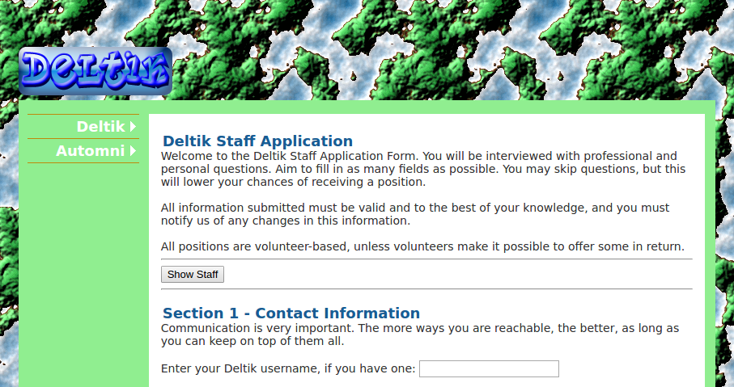

# Legacy Deltik Products

The legacy Deltik products were creations of the Deltik community from 2008 to 2011.

This package contains the files and folders that were in https://products.deltik.org on Friday, 09 September 2016.  Deltik decided to export the legacy products because some ran as live demos on the site and were known to have security and performance flaws.

Some items were excluded or modified for privacy or legal reasons.  Not all legacy Deltik products were put on the products site, so some products aren't in this package either; however, this package does include some unpublished products that were set up on the site anyway.

## Installation

The files in this package can be copied to any web server running PHP 5, and the products should run roughly as they did on Deltik.  Note that some paths were hard-coded and may break on your web server if you aren't pretending to use the virtual host `products.deltik.org`.

### GitHub

To clone from GitHub:

    git clone https://github.com/Deltik/products-legacy.git

This command puts the legacy Deltik products in a folder called `products-legacy/products` in the current directory.

### Archive

A .tar.xz archive containing only the `products` folder can be downloaded directly [from GitHub](https://github.com/Deltik/products-legacy/raw/master/products.tar.xz) or [from Deltik](https://content.deltik.org/products/legacy/products.tar.xz).

Either of these commands performs the download and extraction into the current directory:

    curl -L 'https://github.com/Deltik/products-legacy/raw/master/products.tar.xz' | tar -xJvf -
    
    curl -L 'https://content.deltik.org/products/legacy/products.tar.xz' | tar -xJvf -

## Package Details

### Published Products

Products that had a `demo` setup for live demonstrations and `releases` for downloading the products were considered "published".  These products are in the `pub` folder.

#### `aigui`

**Artificial Intelligence Chat** (`aigui`) was a proxy and unified chat interface for [A.L.I.C.E.](http://alice.pandorabots.com/), [Lauren](http://lauren.vhost.pandorabots.com/pandora/talk?botid=f6d4afd83e34564d), [Elbot](http://www.elbot.com/), [Kyle](http://leeds-city-guide.com/kyle), [Splotchy](https://www.algebra.com/cgi-bin/chat.mpl), and [Sensation Bot](http://sensationbot.com/).

##### Discontinuation
The code was not designed to be extensible or maintainable.  The screen-scraping strategy was poorly concocted, and the communications between the user and the proxy server use an unusual and unreliable custom format.

#### `log2log`

**Log2Log PHP** (`log2log`) was a chat log converter as a web service.

##### Discontinuation

The implementation is very CPU- and RAM-intensive.  Privacy was not properly considered when developing this product.  As a result, [Log2Log as client-side software](http://log2log.sf.net/) succeeded Log2Log PHP.

#### `musespinger`

**Multiple Server Status Pinger** or **MuSeSPinger** (`musespinger`) was a distributed web server status checker that could check the up or down status of multiple remote hosts in one query.  MuSeSPinger could be configured in a network of MuSeSPinger nodes to check the status of remote hosts from different locations.

##### Discontinuation

It is easy to conduct a denial of service attack on MuSeSPinger by specifying many slow hosts to check and repeatedly requesting them until the hosting account running MuSeSPinger exhausts its resources.  Generated images are not cached and take as long to respond as the slowest host checked.

#### `phphistoryhider`

**PHP History Hider** (`phphistoryhider`) was a page where you could enter any URL, and the site would be displayed in an `<iframe>` on the page.  Your browser history would show "PHP History Hider" instead of the titles and URLs of the pages you visit.

##### Discontinuation

Why would you want this?  Modern browsers have private browsing mode.  Besides, PHP History Hider doesn't prevent sites from storing cookies and caching items in your current browser profile.

### Unpublished Products

The folders that aren't `pub` were considered unpublished products.  They were never before released for download on Deltik.

#### `img2php`

**Advanced Image To PHP Converter** (`img2php`) was an unimplemented web service that took image uploads and converted the images into PHP functions that returned the original image for serving to visitors.

Only a web page with no functionality was written.

##### Discontinuation

In most cases, it makes a lot more sense to have the web server serve a pure image rather than to invoke PHP to decode a string and output it as an image.  The intention of this tool was to help make scripts so portable that they could include images in just one `index.php` file.  This product was not completed because it wasn't expected to be very useful.

#### `ismychat`

**IsMyChat** (`ismychat`) was a planned web chatroom system, intended as a replacement for and expansion of the community chatroom at [IsMyWebsite](http://ismywebsite.com/).  IsMyChat initially borrowed code from Kweshuner but did not get anywhere close to a viable product.

##### Discontinuation

There was no reason to reinvent a web messaging platform, especially if the reinvention was done poorly as was the case with IsMyChat.  A frontend to Internet Relay Chat would have obviated IsMyChat anyway, and such frontends do exist already.

#### `kweshuner`

**Kweshuner** (`kweshuner`) was a planned online quiz and survey system that parsed forms from a custom format that was intended to be easy to learn.  There is no working implementation of Kweshuner.

##### Discontinuation

Other learning management systems already do better what Kweshuner was supposed to do.  The custom format is worse than XML and much worse than YAML.

#### `linux`

The Deltik **Linux Resources** (`linux`) were a collection of documents that tried to convince readers to switch their operating system from Microsoft Windows to Linux.

 - `linux/aboutlinux.php` was the original essay.  The target audience was early secondary school students.
 - `linux/linuxupdated.php` was a planned update to the original essay to address criticisms.
 - `linux/index.php` was planned as a Kweshuner quiz to recommend a Linux distribution to users.  This quiz was drafted but not completed because Kweshuner did not become a viable product.
 - `linux/fedora-vista.html` was a table that compared select features from Fedora 9 with Windows Vista.
 - `linux/ubuntu-7.php` was a table that compared select features from Ubuntu 9.04 with Windows 7.

##### Discontinuation

The documents were biased to the point of being inaccurate.  They were not updated or corrected.  The views presented in the documents do not necessarily reflect the views of Deltik today.

#### `loguntu`

**Loguntu** (`loguntu`) was a planned file and chat log hosting service.  It was expected to integrate with Log2Log to provide universal chat logs across all supported instant messaging clients.  No features of Loguntu were implemented, but some file storage tests were performed to evaluate storage strategies.

##### Discontinuation

Development of the upstream project of Loguntu, [Log2Log](http://log2log.sf.net), was suspended, which made Loguntu moot.  There were plans to repurpose Loguntu as a semantic desktop manager, but they did not pass feasibility considerations.

#### `staffapp`

The **Deltik Staff Application Form** (`staffapp`) was a form to apply to be a volunteer for Deltik.  Upon submission of the form, a `sendmail` email would be sent to Deltik.

##### Discontinuation

Deltik became less community-oriented over time and no longer sought administrators, developers, or moderators to support the site.

#### `webdeb`

**WebDeb** (`webdeb`) was a planned port of [`dpkg`](https://wiki.debian.org/Teams/Dpkg) to PHP.  WebDeb would have been the package management system for the planned content management system Automni.  Automni was to [Debian](https://www.debian.org/) as WebDeb was to `dpkg`.

##### Discontinuation

Automni was discontinued, which made WebDeb unnecessary.  Other content management systems proliferated, and Automni was not exceptional enough to be worth pursuing.
